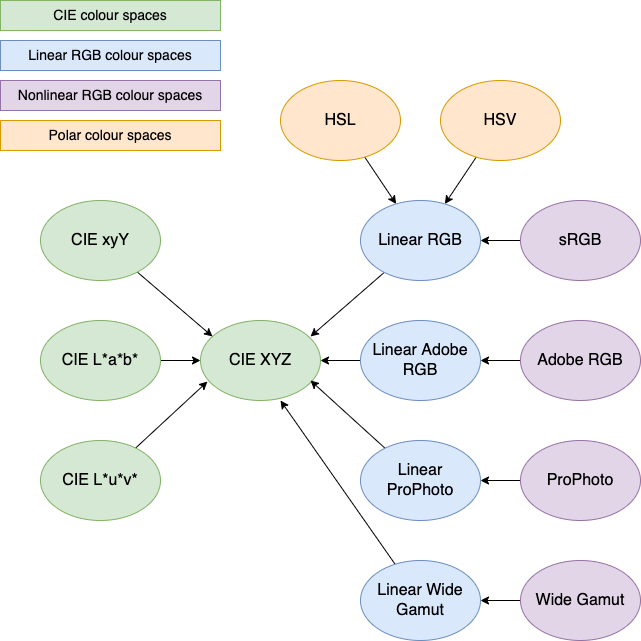

# Colour Space

_[Core Graphics Library by Ross Smith](index.html)_

```c++
#include "rs-graphics-core/colour-space.hpp"
namespace RS::Graphics::Core;
```

## Contents

* TOC
{:toc}

## Colour space concept

### Requirements

`CS` is the colour space; `N` is the number of channels in this colour space
(not counting an alpha channel, which is handled separately); `NB` is the
number of channels in its base space.

```c++
using CS::base = [some colour space];
```

Another colour space from which this one is defined. For the `CIEXYZ` space,
the root of the colour space relationship tree, `CIEXYZ::base` is itself. For
all other colour space classes, the base must be another colour space that
has already been defined. Circular dependencies are not allowed.

```c++
static constexpr std::array<char,N> CS::channels;
```

This is a list of letters representing the colour channels. All elements must
be ASCII upper or lower case letters, with no duplicates. Channel IDs are
case sensitive.

```c++
static constexpr bool CS::is_linear;
```

Indicates that the space can be treated as linear, i.e. operations like
component-wise addition and scalar multiplication are well-defined.

```c++
static constexpr bool CS::is_rgb;
```

True if this is a Cartesian RGB-based colour space.

```c++
static constexpr ColourSpace CS::shape;
```

A constant indicating the geometric properties of the colour space. The
possible values of the `ColourSpace` enumeration are listed below.

```c++
static Vector<T,N> CS::from_base(Vector<T,NB> colour);
static Vector<T,NB> CS::to_base(Vector<T,N> colour);
```

Colour conversion functions between this space and its base space.

### Notes

The rest of this documentation assumes that the reader is familiar with the
basic concepts of colour theory. As a general rule of thumb, if you don't
know what colour space you should be using, you probably want `LinearRGB` for
internal calculations (such as colour blending or interpolation), and `sRGB`
for reading and writing image data. Your image I/O library may handle that
conversion automatically, or it may require you to convert the colour space
when reading or writing pixels.

The colour operations here are only defined for floating point channels, and
are not intended to be called directly by users of this library. Refer to the
[Colour](colour.html) class for user-facing colour operations, on colours
with integer or floating point channels.

As a simplification, I treat colour spaces as stateless. When the definition
of a colour space includes state, such as a choice of standard illuminant,
this will need to be hardcoded into the colour space class, with different
classes (probably template instantiations) for different illuminants. See the
`WorkingSpace` and `NonlinearSpace` templates below for examples.

Definitions of a colour space sometimes vary in the scaling of the
coordinates. Here I use the unit range for CIE XYZ and closely related spaces,
instead of the 0-100 range used in some sources, although I keep the 100-based
scale for CIE L\*a\*b\* and CIE L\*u\*v\* since that is used universally. For
polar spaces such as HSL and HSV, I use a unit scale (i.e. a fraction of a
circle) for the angular coordinate, instead of expressing it in radians or
degrees.

The term "working space" refers to the linear form of a nonlinear RGB space
such as sRGB, before the transfer function ("gamma") has been applied. The
base space of a nonlinear space should be the corresponding working space,
and the working space's own base space should normally be CIE XYZ.

[Bruce Lindbloom's site](http://www.brucelindbloom.com/index.html?Eqn_RGB_XYZ_Matrix.html)
is my main source for the RGB/XYZ matrices.

The following conditions are not checked, but behaviour is undefined if a
colour space violates any of them:

1. `CS::base` must not be the same as `CS` (apart from the CIE XYZ special case).
2. The graph of colour spaces and their base spaces must be a directed acyclic graph, with no loops or disconnected subgraphs.
3. The channel list must be the correct length for the colour space's number of channels.
4. The channel list must contain only ASCII upper and lower case letters.
5. The channel list must not contain any duplicates.
6. If `is_rgb` is true, the channel list must contain exactly three entries.

## Supporting types

```c++
enum class ColourSpace: int {
    any,   // Channel values are unrestricted
    unit,  // Valid colours are restricted to the unit cube
    polar  // The first channel is circular (also implies unit cube)
};
```

This is used to indicate the geometry of a colour space.

## Colour space classes

### List of classes

| Colour space       | Base space         | Linear  | RGB  | Shape  | Description                                   |
| ------------       | ----------         | ------  | ---  | -----  | -----------                                   |
| `CIEXYZ`           | `CIEXYZ`           | Yes     | No   | Unit   | CIE 1931 XYZ colour space                     |
| `CIExyY`           | `CIEXYZ`           | No      | No   | Unit   | CIE 1931 xyY colour space                     |
| `CIELab`           | `CIEXYZ`           | No      | No   | Any    | CIE 1976 L\*a\*b\* colour space               |
| `CIELuv`           | `CIEXYZ`           | No      | No   | Any    | CIE 1976 L\*u\*v\* colour space               |
| `sRGB`             | `LinearRGB`        | No      | Yes  | Unit   | Widely used sRGB standard colour space        |
| `LinearRGB`        | `CIEXYZ`           | Yes     | Yes  | Unit   | Linear RGB working space for sRGB             |
| `AdobeRGB`         | `LinearAdobeRGB`   | No      | Yes  | Unit   | Adobe RGB (1998) colour space                 |
| `LinearAdobeRGB`   | `CIEXYZ`           | Yes     | Yes  | Unit   | Working space for Adobe RGB                   |
| `ProPhoto`         | `LinearProPhoto`   | No      | Yes  | Unit   | ProPhoto colour space (a.k.a. ROMM RGB)       |
| `LinearProPhoto`   | `CIEXYZ`           | Yes     | Yes  | Unit   | Working space for ProPhoto                    |
| `WideGamut`        | `LinearWideGamut`  | No      | Yes  | Unit   | Adobe Wide Gamut colour space (a.k.a. opRGB)  |
| `LinearWideGamut`  | `CIEXYZ`           | Yes     | Yes  | Unit   | Working space for Wide Gamut                  |
| `HSL`              | `LinearRGB`        | No      | No   | Polar  | Polar transformation of linear RGB            |
| `HSV`              | `LinearRGB`        | No      | No   | Polar  | Polar transformation of linear RGB            |

### Relationship diagram

The arrows point from each colour space to its base space.



### CIE colour spaces

#### CIE XYZ

```c++
class CIEXYZ {
    using base = CIEXYZ;
    static constexpr std::array<char, 3> channels = { 'X', 'Y', 'Z' };
    static constexpr bool is_linear = true;
    static constexpr bool is_rgb = false;
    static constexpr ColourSpace shape = ColourSpace::unit;
    template <typename T> static constexpr Vector<T, 3>
        from_base(Vector<T, 3> colour) noexcept { return colour; }
    template <typename T> static constexpr Vector<T, 3>
        to_base(Vector<T, 3> colour) noexcept { return colour; }
};
```

CIE 1931 XYZ colour space.

#### CIE xyY

```c++
class CIExyY {
    using base = CIEXYZ;
    static constexpr std::array<char, 3> channels = { 'x', 'y', 'Y' };
    static constexpr bool is_linear = false;
    static constexpr bool is_rgb = false;
    static constexpr ColourSpace shape = ColourSpace::unit;
    template <typename T> static constexpr Vector<T, 3>
        from_base(Vector<T, 3> colour) noexcept;
    template <typename T> static constexpr Vector<T, 3>
        to_base(Vector<T, 3> colour) noexcept;
};
```

CIE 1931 xyY chromaticity-based colour space.

#### CIE L\*a\*b\* and CIE L\*u\*v\*

```c++
class CIELab {
    using base = CIEXYZ;
    static constexpr std::array<char, 3> channels = { 'L', 'a', 'b' };
    static constexpr bool is_linear = false;
    static constexpr bool is_rgb = false;
    static constexpr ColourSpace shape = ColourSpace::any;
    template <typename T> static Vector<T, 3>
        from_base(Vector<T, 3> colour) noexcept;
    template <typename T> static Vector<T, 3>
        to_base(Vector<T, 3> colour) noexcept;
};
class CIELuv {
    using base = CIEXYZ;
    static constexpr std::array<char, 3> channels = { 'L', 'u', 'v' };
    static constexpr bool is_linear = false;
    static constexpr bool is_rgb = false;
    static constexpr ColourSpace shape = ColourSpace::any;
    template <typename T> static Vector<T, 3>
        from_base(Vector<T, 3> colour) noexcept;
    template <typename T> static Vector<T, 3>
        to_base(Vector<T, 3> colour) noexcept;
};
```

CIE 1976 L\*a\*b\*  and L\*u\*v\* colour spaces.

### RGB colour spaces

#### RGB colour space templates

```c++
template <int64_t M00, int64_t M01, int64_t M02,
    int64_t M10, int64_t M11, int64_t M12,
    int64_t M20, int64_t M21, int64_t M22,
    int64_t Divisor>
class WorkingSpace {
    using base = CIEXYZ;
    static constexpr std::array<char, 3> channels = { 'R', 'G', 'B' };
    static constexpr bool is_linear = true;
    static constexpr bool is_rgb = true;
    static constexpr ColourSpace shape = ColourSpace::unit;
    template <typename T> static constexpr Vector<T, 3>
        from_base(Vector<T, 3> colour) noexcept;
    template <typename T> static constexpr Vector<T, 3>
        to_base(Vector<T, 3> colour) noexcept;
};
```

Template for a generic linear RGB working space. The template arguments are
the elements of the RGB to XYZ conversion matrix, expressed as integer
ratios, in row major order (e.g. the top left entry is `M00/Divisor`).

```c++
template <typename WorkingSpace,
    int64_t GammaNumerator, int64_t GammaDenominator>
class NonlinearSpace {
    using base = WorkingSpace;
    static constexpr std::array<char, 3> channels = { 'R', 'G', 'B' };
    static constexpr bool is_linear = false;
    static constexpr bool is_rgb = true;
    static constexpr ColourSpace shape = ColourSpace::unit;
    template <typename T> static Vector<T, 3>
        from_base(Vector<T, 3> colour) noexcept;
    template <typename T> static Vector<T, 3>
        to_base(Vector<T, 3> colour) noexcept;
};
```

Template for a generic nonlinear RGB colour space that uses a simple exponent
(gamma) for the transfer function. The gamma value is equal to
`GammaNumerator/GammaDenominator`. Colour spaces that use nontrivial transfer
functions (such as sRGB) will need to be individually defined instead of using
this template.

#### sRGB

```c++
using LinearRGB = WorkingSpace<
     4'124'564,  3'575'761,  1'804'375,
     2'126'729,  7'151'522,    721'750,
       193'339,  1'191'920,  9'503'041,
    10'000'000
>;
class sRGB {
    using base = LinearRGB;
    static constexpr std::array<char, 3> channels = { 'R', 'G', 'B' };
    static constexpr bool is_linear = false;
    static constexpr bool is_rgb = true;
    static constexpr ColourSpace shape = ColourSpace::unit;
    template <typename T> static Vector<T, 3>
        from_base(Vector<T, 3> colour) noexcept;
    template <typename T> static Vector<T, 3>
        to_base(Vector<T, 3> colour) noexcept;
};
```

The widely used sRGB standard colour space, and its linear working space.

#### Adobe RGB

```c++
using LinearAdobeRGB = WorkingSpace<
     5'767'309,  1'855'540,  1'881'852,
     2'973'769,  6'273'491,    752'741,
       270'343,    706'872,  9'911'085,
    10'000'000
>;
using AdobeRGB = NonlinearSpace<LinearAdobeRGB, 22, 10>;
```

Adobe RGB (1998) colour space, and its linear working space.

#### ProPhoto

```c++
using LinearProPhoto = WorkingSpace<
     7'976'749,  1'351'917,    313'534,
     2'880'402,  7'118'741,        857,
             0,          0,  8'252'100,
    10'000'000
>;
class ProPhoto {
    using base = LinearProPhoto;
    static constexpr std::array<char, 3> channels = { 'R', 'G', 'B' };
    static constexpr bool is_linear = false;
    static constexpr bool is_rgb = true;
    static constexpr ColourSpace shape = ColourSpace::unit;
    template <typename T> static Vector<T, 3>
        from_base(Vector<T, 3> colour) noexcept;
    template <typename T> static Vector<T, 3>
        to_base(Vector<T, 3> colour) noexcept;
};
```

ProPhoto (a.k.a. ROMM RGB) colour space, and its linear working space.

#### Wide Gamut

```c++
using LinearWideGamut = WorkingSpace<
     7'161'046,  1'009'296,  1'471'858,
     2'581'874,  7'249'378,    168'748,
             0,    517'813,  7'734'287,
    10'000'000
>;
using WideGamut = NonlinearSpace<LinearWideGamut, 563, 256>;
```

Adobe Wide Gamut (a.k.a. opRGB) colour space, and its linear working space.

### Polar colour spaces

#### HSL and HSV

```c++
class HSL {
    using base = LinearRGB;
    static constexpr std::array<char, 3> channels = { 'H', 'S', 'L' };
    static constexpr bool is_linear = false;
    static constexpr bool is_rgb = false;
    static constexpr ColourSpace shape = ColourSpace::polar;
    template <typename T> static constexpr Vector<T, 3>
        from_base(Vector<T, 3> colour) noexcept;
    template <typename T> static constexpr Vector<T, 3>
        to_base(Vector<T, 3> colour) noexcept;
};
class HSV {
    using base = LinearRGB;
    static constexpr std::array<char, 3> channels = { 'H', 'S', 'V' };
    static constexpr bool is_linear = false;
    static constexpr bool is_rgb = false;
    static constexpr ColourSpace shape = ColourSpace::polar;
    template <typename T> static constexpr Vector<T, 3>
        from_base(Vector<T, 3> colour) noexcept;
    template <typename T> static constexpr Vector<T, 3>
        to_base(Vector<T, 3> colour) noexcept;
};
```

Polar transformations of linear RGB.

## Functions

### Conversion functions

```c++
template <typename CS1, typename CS2, typename T>
    Vector<T, CS2::channels.size()>
    convert_colour_space(Vector<T, int(CS1::channels.size())> colour);
```

Converts between any two colour spaces, passing through any intervening base
spaces along the way, by chaining the colour spaces' `to_base()` and
`from_base()` functions.

### Utility functions

```c++
template <typename CS, typename T, int N>
    constexpr bool is_colour_in_gamut(Vector<T, N> colour) noexcept;
```

True if the colour is in gamut for the colour space. For unit-cube or polar
spaces, this checks that all channels are in the range `[0,1]`(or `[0,1)` for
the polar channel). For other spaces, this has nothing to check and always
returns true.

```c++
template <typename CS, typename T, int N>
    constexpr void clamp_colour(Vector<T, N>& colour) noexcept;
```

Clamps the channel values where necessary to ensure that the colour is in
gamut. For polar spaces, the first channel is reduced modulo 1, yielding a
value in the range `[0,1)`. All other channels for polar spaces, and all
channels for unit spaces, are clamped to the range `[0,1]`. For spaces that
are neither polar nor unit-cube, this does nothing.
